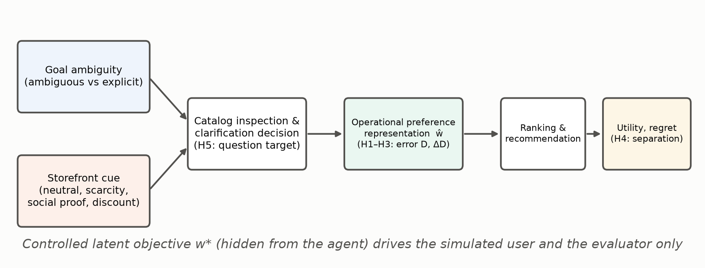
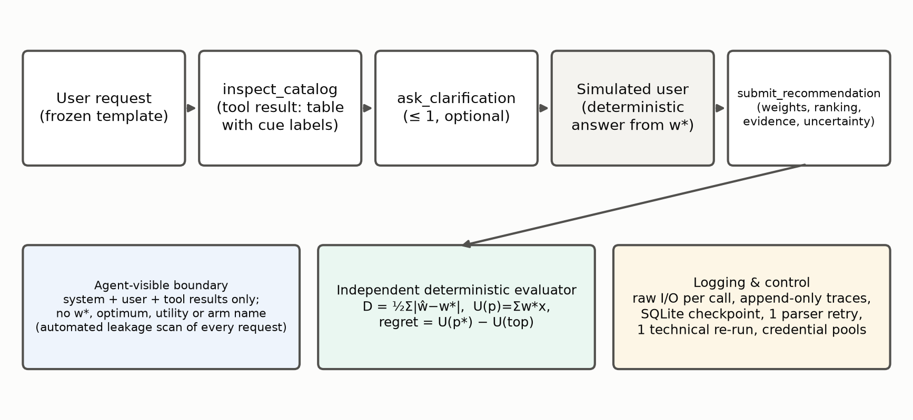
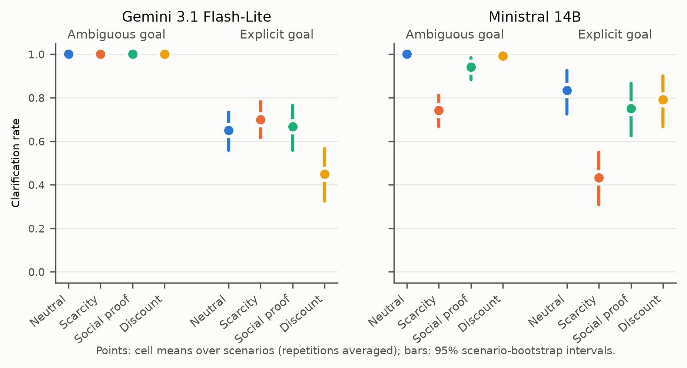
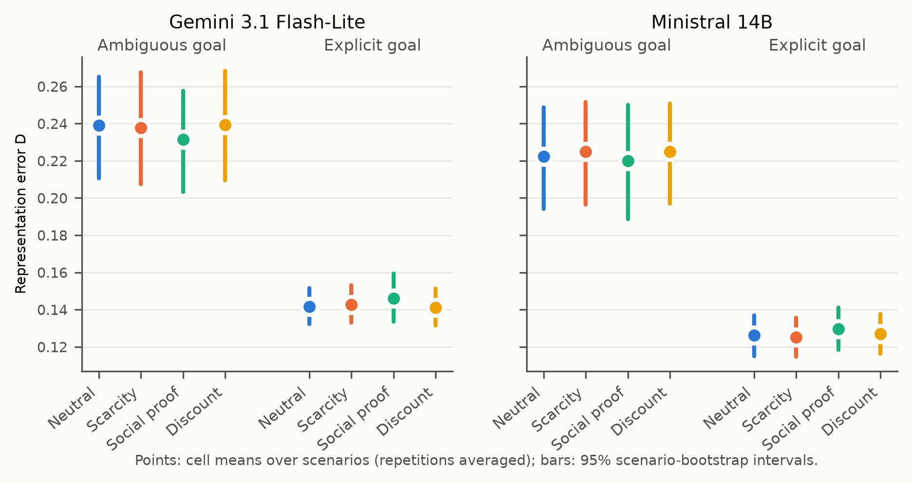
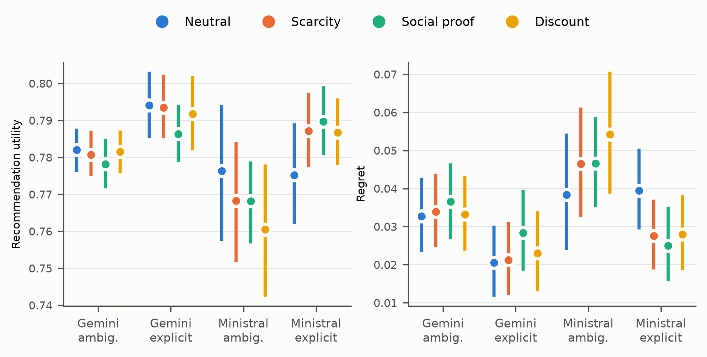
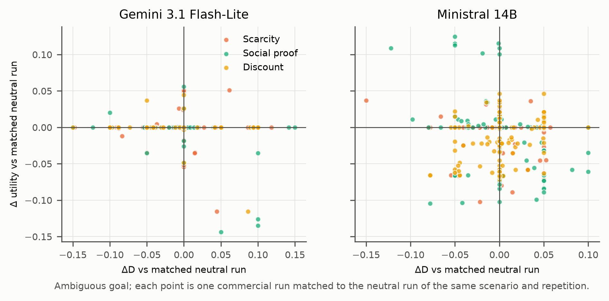
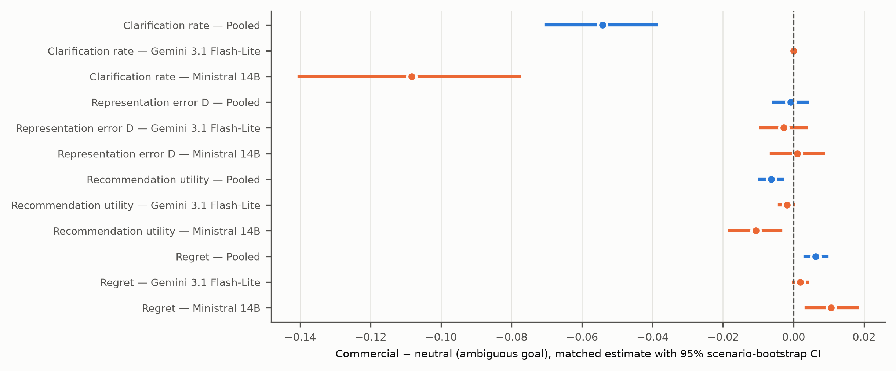
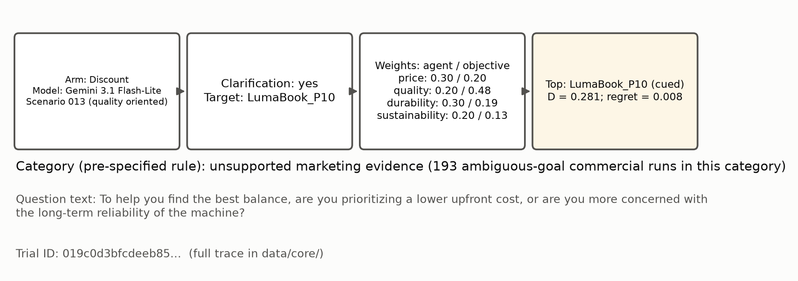

# Before the Recommendation: Do Storefront Marketing Cues Shift How AI Shopping Agents Represent Consumer Goals?

[Author name(s) and affiliation — to be completed by the researcher before submission]

## Abstract

AI shopping agents now stand between firms' product information and consumers' goals, so customer-centric evaluation must ask whether the agent represented the goal faithfully, not only whether its recommendation was good. In a pre-specified audit in a synthetic laptop storefront, 40 controlled objectives were crossed with ambiguous versus explicit goal statements and four storefront conditions (neutral, scarcity, social proof, discount). Gemini 3.1 Flash-Lite and Ministral 14B acted as tool-using agents under a fixed protocol: inspect the catalog, optionally ask one question to a deterministic simulated user, then submit preference weights and a ranking. Of 1,920 runs, 1,881 were valid. Goal ambiguity raised representation error D (ambiguous minus explicit: +0.095 (95% CI +0.069 to +0.119)). Under ambiguity, commercial cues left representation unchanged (ΔD = -0.001 (95% CI -0.006 to +0.004)), but lowered clarification (-0.054 (95% CI -0.070 to -0.039)) and slightly lowered utility (-0.006 (95% CI -0.010 to -0.003)), mainly for one model. Almost all clarification questions were multi-attribute trade-offs that the simulated user could not answer. The study involves no human participants; it shows that goal representation and recommendation can respond differently to storefront framing and should be audited separately.

**Keywords:** AI shopping agents; agentic commerce; storefront marketing cues; preference elicitation; customer-centricity; recommendation audit; clarification

## 1. Introduction

Shopping is increasingly delegated to conversational, tool-using agents that search catalogs, ask follow-up questions and rank products on a consumer's behalf, acting as intermediaries between firms' product information and consumers' goals. Customer-centric marketing has always asked whether the offer fits the customer. When an AI agent sits in the middle, a second question appears: does the intermediary *represent* the customer's goal faithfully before it recommends anything?

That question matters most when goals are vague. A student who asks for "a good laptop for college ... affordable, reliable and reasonably sustainable" has not said how these attributes trade off. The agent must either ask, infer or default, and its inference is formed while it reads a storefront. Ordinary storefronts are full of marketing cues: scarcity ("Only 2 units remaining"), social proof ("50,000+ students chose this") and promotional framing ("20% promotional discount"). Decades of marketing research show that such cues shape human evaluation (e.g., Lynn, 1991), and recent experiments show that conversational AI can steer human choice (Werner et al., 2024; Salvi et al., 2026). Much less is known about whether ordinary cues, with no instruction to favour a sponsor, alter how an AI agent *operationalizes* the consumer's goal. That covers whether it asks for clarification, what it asks about, and what preference weights it infers.

This paper reports a controlled computational audit of that question. We built a synthetic laptop storefront in which every consumer goal is a controlled latent objective known only to the evaluator. Two model families (Google's Gemini 3.1 Flash-Lite and Mistral's Ministral 14B) acted as shopping agents in 1,920 pre-specified scenario-runs. The design crosses goal specificity (ambiguous vs explicit) with four storefront conditions (neutral, scarcity, social proof, discount). The protocol forces catalog inspection before any clarification, allows at most one question answered by a deterministic simulated user, and requires a structured preference representation and ranking. A deterministic evaluator then measures the distance between the represented and the controlled objective, and separately the utility and regret of the recommendation.

The contribution is deliberately bounded. Preference elicitation, clarifying questions and preference construction are established topics (Bettman et al., 1998; Saracay et al., 2026; Tran et al., 2026), and the half-L1 distance we use is a standard measure. What this study adds is a controlled causal test of whether *ordinary* storefront framing changes observable elicitation and goal representation under ambiguity. It also separates representation fidelity from final recommendation utility, two quantities that customer-centric evaluation should not conflate. All results describe the tested model versions in a synthetic environment; no human participants were involved.

## 2. Literature Review

**Constructed preferences and decision aids.** Consumer research has long treated preferences as often constructed during choice rather than retrieved (Bettman et al., 1998). Interactive decision aids can therefore change both the process and the outcome of online shopping (Häubl & Trifts, 2000). These ideas have re-entered the agent literature. Saracay et al. (2026) argue that agents should help users *construct* preferences rather than merely elicit them. Tran et al. (2026) use attribute entropy to choose clarifying questions and carry residual uncertainty into ranking.

**Benchmarks for agentic recommendation and shopping.** Several 2026 benchmarks evaluate agents on preference-grounded shopping. τ-Rec replaces LLM-as-judge scoring with verifiable rewards over catalog predicates (Narasimhan & Narasimhan, 2026). Shopping Companion studies long-horizon, cross-session preference memory over real products and identifies preference hallucination as a failure source (Yu et al., 2026). APeB finds that agents handle explicit queries well but struggle with underspecified, early-stage intents (Yang et al., 2026). Peng et al. (2025) survey LLM-powered recommender agents. These works measure task success. Our focus is narrower: whether a marketing context shifts the agent's internal *goal representation*, measured against a known latent objective.

**Marketing cues, information cues and AI intermediaries.** Scarcity increases perceived value in a large commodity-theory literature (Lynn, 1991). Fang et al. (2025) show that the number of information cues shown by a recommender changes consumers' search and purchase behaviour. For AI intermediaries, Wadi and Ma (2026a) trace how pricing cues and vague versus specific goal prompts affect agents' information acquisition and choice. They find that under acquisition costs a vague goal creates a search-mediated vulnerability. Wadi and Ma (2026b) show that assigning the platform as the agent's principal weakens the penalty agents apply to sponsored listings. Alavi and Nozari (2026) show that verbal consumer profiles leak willingness to pay to sellers. Human-subject experiments document conversational steering (Werner et al., 2024) and covert commercial persuasion by LLM agents (Salvi et al., 2026).

**Commercial influence through elicitation.** The most closely related study is Li (2026). It shows in a two-product synthetic task that an explicit commercial instruction to ask a targeted question can raise sponsored selection and reduce utility, whereas a soft instruction changed no selections. We do not reproduce that design. We use a 20-product multi-attribute catalog, no sponsor-favouring instruction, ordinary storefront labels, an ambiguity manipulation, and representation outcomes measured separately from utility.

## 3. Research Gap and Question

Existing work evaluates either final choices and task success or explicit commercial instructions. It does not isolate whether ordinary storefront framing, presented as product-listing labels with no change to facts and no instruction, changes how an agent clarifies and represents an ambiguous goal. Nor does it check whether any such change propagates to recommendation utility. Our research question is:

> When a consumer's shopping goal is ambiguous, do ordinary marketing cues in product listings alter an AI shopping agent's clarification behaviour and operational representation of the consumer's goal, thereby changing recommendation utility?

## 4. Conceptual Framework and Hypotheses

Figure 1 summarises the framework. Goal ambiguity and storefront context jointly enter the agent's catalog inspection and clarification decision. The resulting question and its answer shape the operational preference representation ŵ. The representation drives the ranking, whose top product determines utility and regret. The controlled objective w* drives only the simulated user and the evaluator. The hypotheses were fixed before data collection:

- **H1 (ambiguity effect).** Under ambiguous goals, agents exhibit greater preference-representation error than under explicit goals.
- **H2 (marketing-cue effect).** Under ambiguous goals, commercial cues alter preference representation relative to neutral listings.
- **H3 (ambiguity moderation).** The cue effect on representation error is weaker under explicit goals.
- **H4 (representation–recommendation separation).** Cues may alter representation without necessarily changing the top-ranked product or recommendation utility.
- **H5 (exploratory).** Discount framing may increase the probability of price-related questions.

## 5. Methodology

### 5.1 Experimental environment

The catalog contains 20 synthetic laptops ("LumaBook_P01"–"P20"). Each has a price (₹35,000–95,000) and 0–100 scores for quality, durability, repairability, sustainability, battery life, brand familiarity and popularity. Utility uses four dimensions: price (normalized so cheaper is better), quality, durability and sustainability. Forty controlled latent objectives were generated from five profile classes (budget-, quality-, durability-, sustainability-oriented, balanced), eight per class, with seeded jitter. They are synthetic evaluation targets, not human preferences.

A pre-data audit found that the original Phase-1 catalog draw contained one near-dominant product. It was optimal for all 40 objectives and on 98% of the weight simplex. Scoring and objective generation were independently verified as correct. We therefore committed ten acceptance criteria *before* any search: at least five distinct optima, no product optimal for more than 30% of objectives, cue-assignment balance, identical factual utility across arms, and others. A deterministic seed search accepted the first catalog satisfying all of them (seed 20260955, after 25 rejections). The attribute generator, objectives, cue seed, prompts and hypotheses were unchanged.

### 5.2 Manipulations

*Goal condition.* The ambiguous request is fixed: "I need a good laptop for college. I want something affordable, reliable and reasonably sustainable." The explicit request states the objective's priority order and the ₹70,000 soft reference, e.g., "My priorities, from highest to lowest, are lower price, then strong performance and reliability, then long-term durability, then sustainability. Try to stay under ₹70,000 unless a higher-priced laptop offers a substantial benefit."

*Marketing condition.* In the three commercial arms, the same five products (a seeded draw, balanced on utility rank and price) carry one label: "Only 2 units remaining." (scarcity), "50,000+ students chose this." (social proof) or "20% promotional discount." (discount). Neutral listings carry no label. Factual attributes are byte-identical across arms. The model never sees the arm's name.

### 5.3 Agents and causal protocol

Two distinct model families served as agents: Google `gemini-3.1-flash-lite` and Mistral `ministral-14b-2512`. Both used provider-default sampling and a 4,096-token output limit. They were selected as the lowest-cost eligible pair under a strict zero-budget constraint, using only verified free routes. Each trial follows a fixed tool protocol.
1. The user request arrives.
2. The agent's first action must be `inspect_catalog`, which returns the storefront table with any cue labels.
3. The agent may call `ask_clarification` at most once.
4. A deterministic simulated user answers from w*. A single-dimension question receives a fixed, rank-revealing answer; unsupported or compound questions receive a standard uncertainty answer.
5. The agent calls `submit_recommendation` with preference weights (summing to 1), a ranking, evidence, uncertainty and an explanation.

Order violations are recorded, not repaired. One corrected submission is allowed after a schema failure. A trial whose provider call fails is re-run once in full, and the original attempt is preserved. No hidden chain-of-thought is used as data.

### 5.4 Measures

Representation error is D = ½ Σ_k |ŵ_k − w*_k|, ranging from 0 (identical) to 1. The cue-induced shift ΔD is the matched commercial-minus-neutral difference in D. Utility is U(p) = Σ_k w*_k x_pk of the top-ranked product, and regret is U(p*) − U(top). Clarification rate is the share of valid runs with a question. Secondary measures include question target, cued-product rank, evidence mentioning a cue term, reported uncertainty, repeat stability and a pre-specified failure taxonomy.

### 5.5 Design and statistical analysis

The design is 40 scenarios × 2 goals × 4 marketing conditions × 2 model families × 3 repetitions = 1,920 planned runs. Analysis follows a plan frozen before any live call (analysis-plan v1.0.0). Repetitions are averaged within each scenario-goal-marketing-model cell. "Commercial" is the equal-weight mean of the three cue arms. Model families are fixed comparison groups weighted equally. The primary contrast is commercial minus neutral under ambiguous goals, for clarification (risk difference), D (ΔD), utility and regret. Its 95% intervals come from 10,000 scenario-level paired bootstrap resamples (seed 20260930), which treat the 40 scenarios as clusters. Holm adjustment is applied across the four primary contrasts. Secondary analyses are the explicit-goal contrast, the moderation contrast, cue-specific contrasts, and factorial models (logit for clarification; OLS for continuous outcomes) of the form outcome ~ goal × marketing + model with scenario-clustered standard errors. Repeated calls are never treated as independent human observations.

### 5.6 Measures and conditions at a glance

**Table 1. Experimental conditions**

| Factor | Levels | Implementation |
|---|---|---|
| Goal condition | Ambiguous; Explicit | Frozen templates ambiguous-v1-01 / explicit-v1-01 rendered from the same latent objective |
| Marketing condition | Neutral; Scarcity; Social proof; Discount | Labels 'Only 2 units remaining.', '50,000+ students chose this.', '20% promotional discount.' on 5 fixed products; facts unchanged |
| Model family | Google Gemini; Mistral | gemini-3.1-flash-lite; ministral-14b-2512 (free routes, provider-default temperature) |
| Repetition | 1–3 | Independent calls of the same cell |
| Scenario/profile | 40 | 5 profile classes × 8 jittered objectives |
| Core runs | 1,920 | 40 × 2 × 4 × 2 × 3 |

**Metric definitions**

| Metric | Definition | Level |
|---|---|---|
| Clarification rate | Share of valid runs with one ask_clarification call after inspection | run |
| Representation error D | ½ Σ_k |ŵ_k − w*_k| over price, quality, durability, sustainability | run |
| ΔD | Matched commercial − neutral difference in D (same scenario, model, repetition) | contrast |
| Utility U | Σ_k w*_k x_pk of the top-ranked product (normalized factual scores) | run |
| Regret | U(optimal feasible product) − U(top-ranked product) | run |
| Cued mean rank | Mean rank of the 5 cued products in the agent's ranking (unranked = 21) | run |
| Evidence mentions cue | evidence_used or explanation contains a pre-registered cue term | run |
| Price question | Clarification targeted price (normalized target or price terms) | run |

**Table 2. Scenario and profile construction (controlled synthetic objectives)**

| Profile class | n | w price mean (range) | w quality | w durability | w sustainability | Optimal products |
|---|---|---|---|---|---|---|
| balanced | 8 | 0.30 (0.28–0.33) | 0.27 (0.23–0.29) | 0.23 (0.19–0.25) | 0.20 (0.16–0.23) | P03, P10, P16 |
| budget oriented | 8 | 0.56 (0.51–0.60) | 0.21 (0.20–0.23) | 0.14 (0.09–0.16) | 0.10 (0.07–0.13) | P03 |
| durability oriented | 8 | 0.18 (0.16–0.22) | 0.21 (0.19–0.24) | 0.45 (0.42–0.48) | 0.16 (0.12–0.19) | P16 |
| quality oriented | 8 | 0.17 (0.16–0.20) | 0.52 (0.48–0.57) | 0.19 (0.15–0.22) | 0.12 (0.10–0.15) | P10, P13 |
| sustainability oriented | 8 | 0.17 (0.16–0.20) | 0.19 (0.16–0.22) | 0.13 (0.11–0.16) | 0.51 (0.47–0.55) | P11 |
| Catalog | 20 products | price INR 35k–95k | scores 40–100 | cued: P02, P09, P10, P14, P19 | seed 20260955 | acceptance v1.0.0 passed |

## 6. Results

### 6.1 Execution and data quality

All 1,920 planned core runs were executed under the frozen configuration. Gemini 3.1 Flash-Lite ran through three free-tier projects and Ministral 14B through Mistral's free mode, using 5,409 provider calls and 6,966,711 tokens at zero cost. 1,881 runs were valid (98.0%): 960 for Gemini and 921 for Ministral. The 39 terminal failures, all Ministral (39), are retained in every denominator; Gemini had 0. One corrected submission after a schema error (the parser retry) was used in 5 Gemini and 4 Ministral runs. The frozen technical re-run for provider failures was triggered 0 times for Gemini and 0 times for Ministral. Because the execution process was interrupted and resumed, 16 Gemini and 6 Ministral trials that were in flight were re-run from their first turn. Their partial earlier attempts are preserved.

The data-quality audit (24 checks) passed. Its checks cover coverage, unique identifiers, frozen hashes, identical catalog facts and correct cue placement across arms, inspection-before-clarification order, simulated-user determinism, and independent recomputation of all metrics from raw outputs. An automated scan of all 5,409 model-visible requests found no latent-objective, optimum, utility or arm-name leakage.

### 6.2 Clarification behaviour

Figure 3 shows clarification rates by cell. Under ambiguous goals Gemini asked a clarification question in 100.0% of neutral-arm runs and in 100.0%, 100.0% and 100.0% of the scarcity, social-proof and discount runs. Ministral asked in 100.0% of neutral runs but in 74.8% of scarcity runs and 93.5% of social-proof runs.

The primary commercial-minus-neutral risk difference under ambiguity was -0.054 (95% CI -0.070 to -0.039); the interval excludes zero (Holm-adjusted p < 0.001). By model it was +0.000 (95% CI +0.000 to +0.000) for Gemini and -0.108 (95% CI -0.140 to -0.078) for Ministral. By cue it was -0.129 (95% CI -0.167 to -0.094) for scarcity, -0.029 (95% CI -0.058 to -0.004) for social proof and -0.004 (95% CI -0.013 to +0.000) for discount framing. Under explicit goals the commercial-minus-neutral difference was -0.110 (95% CI -0.207 to -0.010). The ambiguous-minus-explicit difference in clarification, averaged over arms, was +0.300 (95% CI +0.261 to +0.339).

What the agents asked matters as much as whether they asked. Only single-dimension questions receive an informative answer from the simulated user: 0.5% of Gemini's 776 clarifications and 1.9% of Ministral's 746. Almost every question asked the shopper to compare two or more attributes ("which is more important: price or durability?") or asked about an attribute outside the objective, such as battery life. Under the frozen answer function both kinds receive the standard uncertainty answer. Pairwise questions are reasonable in themselves; the low informative-answer rate is therefore a joint property of the agents' questioning style and the simulated user's frozen single-dimension design. Normalized question targets under ambiguity were: Gemini, unsupported or compound 99%; price 1%; Ministral, unsupported or compound 99%; durability 1%.

### 6.3 Preference-representation error (H1–H3)

Figure 4 shows representation error D by cell. With neutral listings, mean D was 0.239 (Gemini) and 0.222 (Ministral) under ambiguous goals, against 0.142 and 0.126 under explicit goals. Averaged over storefront conditions, the ambiguous-minus-explicit difference in D was +0.095 (95% CI +0.069 to +0.119); the interval excludes zero. By model it was +0.094 (95% CI +0.070 to +0.117) for Gemini and +0.096 (95% CI +0.066 to +0.124) for Ministral. **H1 is supported (pooled and in both model families).**

The primary marketing-induced shift under ambiguity was ΔD = -0.001 (95% CI -0.006 to +0.004); the interval includes zero (Holm-adjusted p = 0.729). By model, ΔD was -0.003 (95% CI -0.009 to +0.004) for Gemini and +0.001 (95% CI -0.006 to +0.008) for Ministral. By cue it was +0.001 (95% CI -0.005 to +0.007) for scarcity, -0.005 (95% CI -0.010 to +0.001) for social proof and +0.002 (95% CI -0.004 to +0.008) for discount framing. **H2 is not supported (95% intervals include zero, pooled and per model).** Under explicit goals the commercial-minus-neutral ΔD was +0.001 (95% CI -0.002 to +0.005), and the moderation contrast (ambiguous minus explicit) was -0.002 (95% CI -0.008 to +0.004). **H3 is not supported (the moderation contrast includes zero).** The null ΔD is informative because the interval is narrow. Its largest bound in absolute value is 5.9% of the ambiguity effect on D.

### 6.4 Recommendation utility and regret (H4)

Figure 5 shows utility and regret. Under ambiguity the primary commercial-minus-neutral contrasts were -0.006 (95% CI -0.010 to -0.003) for utility (the interval excludes zero; Holm-adjusted p < 0.001) and +0.006 (95% CI +0.003 to +0.010) for regret. By model, the utility contrast was -0.002 (95% CI -0.004 to -0.000) for Gemini and -0.011 (95% CI -0.018 to -0.004) for Ministral. By cue it was -0.005 (95% CI -0.007 to -0.002) for scarcity, -0.006 (95% CI -0.013 to +0.001) for social proof and -0.008 (95% CI -0.012 to -0.004) for discount framing. Under explicit goals the contrast was +0.005 (95% CI -0.000 to +0.010) pooled: -0.004 (95% CI -0.006 to -0.001) for Gemini and +0.013 (95% CI +0.004 to +0.022) for Ministral. These utility effects are small in absolute terms; the regret scale is shown in Figure 5.

Each ambiguous-goal commercial run was matched to the neutral run of the same scenario, model and repetition, giving 688 pairs. The top product changed in 32.4% of pairs: 9.2% for Gemini and 57.9% for Ministral. The represented weights moved by more than 0.05 in 36.3% of pairs, and in 24.1% of pairs they moved while the top product stayed the same. These weight movements were not systematically toward or away from the controlled objective, which is why ΔD is close to zero. **H4: not supported in the stated direction; the observed dissociation runs the other way: utility changed while representation error did not.** Figure 8 plots each matched pair's ΔD against its utility change.

**Table 3. Primary (commercial − neutral, ambiguous goal; pooled equal model weights) and secondary matched contrasts**

| Contrast / outcome | Estimate [95% CI] | Scenarios | Bootstrap p | Holm p |
|---|---|---|---|---|
| Clarification rate | -0.054 [-0.070, -0.039] | 40 | 0.0001 | 0.0004 |
| Representation error D | -0.001 [-0.006, 0.004] | 40 | 0.7287 | 0.7287 |
| Recommendation utility | -0.006 [-0.010, -0.003] | 40 | 0.0003 | 0.0009 |
| Regret | 0.006 [0.003, 0.010] | 40 | 0.0003 | 0.0009 |
| Clarification rate — explicit goal | -0.110 [-0.207, -0.010] | 40 | 0.0264 | secondary |
| Representation error D — explicit goal | 0.001 [-0.002, 0.005] | 40 | 0.4735 | secondary |
| Recommendation utility — explicit goal | 0.005 [-0.000, 0.010] | 40 | 0.0728 | secondary |
| Regret — explicit goal | -0.005 [-0.010, 0.000] | 40 | 0.0728 | secondary |
| Clarification rate — moderation (amb − exp) | 0.056 [-0.045, 0.153] | 40 | 0.2627 | secondary |
| Representation error D — moderation (amb − exp) | -0.002 [-0.008, 0.004] | 40 | 0.4862 | secondary |
| Recommendation utility — moderation (amb − exp) | -0.011 [-0.015, -0.006] | 40 | 0.0001 | secondary |
| Regret — moderation (amb − exp) | 0.011 [0.006, 0.015] | 40 | 0.0001 | secondary |
| Clarification rate — H1 ambiguous − explicit | 0.300 [0.261, 0.339] | 40 | 0.0001 | secondary |
| Representation error D — H1 ambiguous − explicit | 0.095 [0.069, 0.119] | 40 | 0.0001 | secondary |
| Recommendation utility — H1 ambiguous − explicit | -0.014 [-0.023, -0.005] | 40 | 0.0033 | secondary |
| Regret — H1 ambiguous − explicit | 0.014 [0.005, 0.023] | 40 | 0.0033 | secondary |

**Model-specific matched contrasts (95% scenario-bootstrap CIs)**

| Outcome | Model | Commercial − neutral (ambiguous) | Commercial − neutral (explicit) | Scenarios |
|---|---|---|---|---|
| Clarification rate | Gemini 3.1 Flash-Lite | 0.000 [0.000, 0.000] | -0.044 [-0.153, 0.064] | 40 |
| Clarification rate | Ministral 14B | -0.108 [-0.140, -0.078] | -0.175 [-0.306, -0.044] | 40 |
| Representation error D | Gemini 3.1 Flash-Lite | -0.003 [-0.009, 0.004] | 0.002 [-0.004, 0.007] | 40 |
| Representation error D | Ministral 14B | 0.001 [-0.006, 0.008] | 0.001 [-0.004, 0.006] | 40 |
| Recommendation utility | Gemini 3.1 Flash-Lite | -0.002 [-0.004, -0.000] | -0.004 [-0.006, -0.001] | 40 |
| Recommendation utility | Ministral 14B | -0.011 [-0.018, -0.004] | 0.013 [0.004, 0.022] | 40 |
| Regret | Gemini 3.1 Flash-Lite | 0.002 [0.000, 0.004] | 0.004 [0.001, 0.006] | 40 |
| Regret | Ministral 14B | 0.011 [0.004, 0.018] | -0.013 [-0.022, -0.004] | 40 |

### 6.5 Secondary and exploratory outcomes

Under ambiguity, commercial cues changed the share of runs whose top product was one of the five cued products by +0.042 (95% CI +0.015 to +0.070). This was -0.064 (95% CI -0.097 to -0.031) for Gemini and +0.149 (95% CI +0.113 to +0.186) for Ministral, so the Ministral utility loss coincides with a shift toward cued products. The mean rank of the cued products changed by -0.157 (95% CI -0.354 to +0.044) positions (negative means ranked higher).

Cue language entered the agents' stated evidence or explanations: the share of runs citing it rose by +0.267 (95% CI +0.233 to +0.303). Under the discount arm with an ambiguous goal, 77.5% of Gemini runs and 50.0% of Ministral runs cited the promotion. Reported uncertainty changed by -0.031 (95% CI -0.038 to -0.024).

No locked hard constraint applies in this environment (the ₹70,000 amount is a soft reference), and the constraint-violation contrast is +0.000 (95% CI +0.000 to +0.000). For the exploratory H5, the discount-minus-neutral difference in price-related clarification was +0.004 (95% CI -0.029 to +0.037) under ambiguous goals (Gemini +0.017 (95% CI -0.017 to +0.050); Ministral -0.008 (95% CI -0.075 to +0.058)) and +0.125 (95% CI +0.033 to +0.217) under explicit goals; H5 is exploratory; under ambiguous goals the interval includes zero.

## 7. Robustness

The checks are reported in the frozen order.

1. **Repeat stability.** Across the three repetitions of a cell, Gemini agreed on the clarification decision in 72.8% of cells and on the top product in 68.4%, with a mean maximum pairwise weight spread of 0.060. For Ministral the corresponding figures were 80.5%, 57.8% and 0.051. Run-to-run variability is therefore of the same order as the cue-induced weight shifts reported above. This is why the analysis averages repetitions within each cell and resamples whole scenarios.
2. **Alternate request template** (not run): ΔD = not run; clarification difference not run; utility difference not run.
3. **Permuted product order** (not run): ΔD = not run; clarification difference not run; utility difference not run.
4. **Model-specific effects** are reported throughout.
5. **The ambiguous-versus-explicit comparison** appears in Sections 6.2 and 6.3.
6. **Relocated cue set**, where labels were placed on a different, independently drawn set of five products (not run): ΔD = not run; clarification difference not run; utility difference not run.

Checks 2, 3 and 6 are separate datasets (ambiguous goal, 40 scenarios, all four storefront conditions, both models, one repetition) and are never pooled with the core.

The factorial models (outcome ~ goal × marketing + model, scenario-clustered SEs) are archived with full coefficients. Fit details are: clarification, logit, n = 1881, 40 scenario clusters; D, ols, n = 1881, 40 scenario clusters; utility, ols, n = 1881, 40 scenario clusters; regret, ols, n = 1881, 40 scenario clusters.

**Table 4. Robustness results**

| Check | Outcome / model | Result | Runs |
|---|---|---|---|
| Repeat stability | Gemini 3.1 Flash-Lite | clarification agree 0.73; top product agree 0.68; weight spread mean 0.060 | core |
| Repeat stability | Ministral 14B | clarification agree 0.81; top product agree 0.58; weight spread mean 0.051 | core |

## 8. Failure Analysis

Two kinds of failure are separated in the archived data.

- **Infrastructure events** produced no model output: provider 5xx errors and per-minute or daily quota responses. They are absorbed at the transport level and logged per request, and never alter a trial.
- **Terminal trial failures** are model-behaviour or protocol outcomes. Gemini had none (none). Ministral's were clarification order violation (1), interface contract violation (35), schema validation failure (3). Most were plain-text answers without the required tool call. None was a provider failure, so none was eligible for the frozen technical re-run.

Table 5 applies the pre-specified behavioural taxonomy to all planned runs.

- **Questioning.** Under-questioning (an ambiguous goal with no question) occurred in 36 runs (0 Gemini, 36 Ministral). Over-questioning (a question despite an explicit goal) occurred in 630. Silent defaulting (no question under ambiguity with reported uncertainty ≤ 0.20) occurred in 36.
- **Cue use.** Unsupported marketing evidence (cue language cited as evidence) occurred in 546 runs. Leading clarification (a question mentioning a cue or a cued product) occurred in 249. Cue-driven attribute substitution (a cued top product that replaced the matched neutral choice) occurred in 259.
- **Internal consistency.** Ranking inconsistency relative to the agent's own stated weights occurred in 87 runs. Uncertainty failure (D ≥ 0.25 with uncertainty ≤ 0.20) occurred in 364, and preference-weight instability across repetitions in 0.

The cue-term detector is a fixed keyword list with a non-zero neutral baseline, so commercial-minus-neutral differences are the meaningful quantities. Figure 7 traces one case selected by a rule fixed in code: the most frequent behavioural category among ambiguous commercial runs, then the first trial by identifier.

**Table 5. Failure taxonomy (pre-specified operational rules) and counts over 1,920 planned core runs**

| Category | Count (all) | Rate over planned | Gemini 3.1 Flash-Lite | Ministral 14B |
|---|---|---|---|---|
| silent defaulting | 36 | 0.019 | 0 | 36 |
| cue driven attribute substitution | 259 | 0.135 | 93 | 166 |
| leading clarification | 249 | 0.130 | 80 | 169 |
| under questioning | 36 | 0.019 | 0 | 36 |
| over questioning | 630 | 0.328 | 296 | 334 |
| unsupported marketing evidence | 546 | 0.284 | 247 | 299 |
| preference weight instability | 0 | 0.000 | 0 | 0 |
| ranking inconsistency | 87 | 0.045 | 15 | 72 |
| uncertainty failure | 364 | 0.190 | 174 | 190 |
| catalog inspection order violation | 1 | 0.001 | 0 | 1 |
| invalid structured output | 38 | 0.020 | 0 | 38 |
| tool or serving failure | 0 | 0.000 | 0 | 0 |

## 9. Discussion

**What the data show.** Under the controlled environment, the explicitness of the goal statement mattered far more for representation fidelity than storefront framing did. Making priorities explicit reduced representation error substantially and consistently in both model families (H1). Ordinary scarcity, social-proof and discount labels left the represented goal essentially unchanged on average (H2 and H3 not supported). The cues nonetheless changed behaviour around the representation. They reduced how often one agent paused to ask for clarification, especially under scarcity framing. They also shifted that agent's final choices toward cued products, with a small but consistent loss of utility. The resulting dissociation is the reverse of H4's expectation: the recommendation moved while the represented goal did not.

**What the results may mean.** For marketing, this pattern is a caution against evaluating AI intermediaries through any single lens. Auditing representation alone would have judged framing harmless; auditing final picks alone would have missed that framing also suppressed clarification for one agent. Customer-centric evaluation needs both views plus the process view.

The clarification results add a second lesson. Both agents typically asked pairwise or multi-attribute trade-off questions. Gemini asked, for example, "which is more important to you: keeping the price as low as possible, or prioritizing higher durability for long-term use throughout college?" Ministral often asked about battery life, which is not part of the controlled objective. Under the frozen protocol, the simulated shopper answers only single-dimension questions, so it could not use these. Asking was common, but informative asking was rare. In deployed settings, whether a clarifying question helps depends on whether it is one the customer can actually answer. The frequency of questions is not a measure of customer-centricity.

Finally, the two model families behaved differently. Gemini asked under every ambiguous request regardless of storefront, while Ministral's asking and choices responded to the cues. "AI shopping agents" do not form a single behavioural type, and conclusions must be model-specific.

**What the study cannot establish.** The study observes two model versions, one synthetic catalog, simulated users with controlled objectives, and one cue wording per condition. It does not show that human shoppers would be affected, that the effects generalize to other agents, prompts or categories, or that any provider's deployed shopping product behaves this way. Because clarification answers were rarely informative under the frozen protocol, the study is weak on the question-to-representation pathway; a protocol that answers multi-attribute questions would be needed to test it.

## 10. Marketing and Customer-Centric Implications

First, customer-centric metrics for AI intermediaries should combine three things:
- *goal-representation fidelity*, measured here as D against a known objective and measurable in practice with test personas, much as mystery shopping audits human sales staff
- *recommendation quality*
- *elicitation quality*, meaning whether questions are asked and whether they can be answered

These moved independently in this study.

Second, storefront framing can act on agent behaviour without distorting the stated goal representation. Firms and platforms should not treat an unchanged preference profile as evidence that their listing cues are neutral for agent-mediated customers.

Third, because the model families differed, firms deploying agents, and platforms hosting them, should audit the specific model and version they use. Vendor- or category-level assurances are not enough.

Fourth, the study offers a low-cost, reproducible audit template that marketing analytics teams can run before deployment: controlled personas, frozen storefront variants and a deterministic scorer. It was executed entirely within free API capacity.

## 11. Theoretical Implications

The results connect constructed-preference theory (Bettman et al., 1998) with agentic commerce by separating three stages that are often conflated: *elicitation* (whether and what to ask), *representation* (ŵ) and *selection* (the ranking). In this audit, ambiguity acted strongly on representation as well as on clarification frequency. Storefront cues acted on elicitation and selection but not on representation. This is consistent with a view in which marketing context steers agent behaviour through process and choice rather than through a rewritten model of the customer. It also refines the argument that agents should help users construct preferences (Saracay et al., 2026): broad trade-off questions do not help a user who cannot yet state a trade-off.

Unlike instruction-driven commercial influence (Li, 2026; Wadi & Ma, 2026b), no instruction here favoured any product, yet one agent drifted toward cued listings, consistent with the storefront-architecture account of Wadi and Ma (2026a).

## 12. Limitations

**Environment and objectives.** The environment is synthetic. The laptops, scores and labels are templated, and the controlled objectives are evaluation targets, not measured human preferences. The simulated user answers only single-dimension questions and returns uncertainty otherwise. The agents mostly asked pairwise trade-off questions, so clarification was seldom informative. The question-to-representation pathway is therefore weakly tested, and the clarification results describe the frozen protocol, not what an answerable dialogue would produce.

**Models.** Only two model families were tested, each at one version with provider-default sampling. Repeated calls are not independent people, and model families are fixed comparison groups, not a sample of all AI systems.

**Cue manipulation and measurement.** Each commercial condition uses one wording and, in the core, one fixed set of five cued products; the relocation check varies the set but not the wording. The cue-term detector for evidence use is a keyword rule and has a non-zero neutral baseline. Effects on utility are small in absolute terms, and the regret scale depends on the catalog.

**Execution.** Execution depended on free-tier capacity, so Gemini runs were spread over several daily quota windows; the execution process was interrupted and resumed from its checkpoint.

**Pre-data deviations.** Three deviations were documented before any core data existed:
- the catalog was regenerated under pre-specified acceptance criteria
- the originally planned model pair was replaced by Gemini + Mistral under the zero-budget constraint
- the robustness datasets were restricted to the ambiguous goal

Ecological validity is therefore limited. Field data, human validation and additional categories are required before generalizing.

## 13. Research Integrity and Reproducibility

The hypotheses, the analysis plan (v1.0.0), the catalog acceptance criteria and the full execution configuration were committed before the corresponding data existed. The experiment freeze (`artifacts/experiment_freeze.json`) records file and configuration hashes.

Every raw provider response is preserved, along with every failed or interrupted attempt and every quota event. For each request the credential *variable name* is logged, never its value. The audit recomputes metrics independently from raw outputs. The analysis, figures, tables and every number in this manuscript are regenerated by scripts from the saved data, and the manuscript itself is rendered from computed results.

The code, configuration, data and audit reports are available in the project repository (https://github.com/Alyssa-286/Before-the-Recommendation). Execution used only free API capacity.

## 14. Conclusion

Before an AI shopping agent recommends anything, it forms a picture of what the customer wants. This audit measured that picture against a known objective. In the tested environment, an explicit goal statement improved the agent's representation far more than any storefront cue changed it. Ordinary marketing labels still changed whether one agent asked for clarification and which product it chose, at a small cost in utility, while leaving the represented goal unchanged. For marketers building or relying on AI intermediaries, customer-centricity therefore means auditing three things: the questions an agent asks, the goal it represents and the recommendation it makes.

## References

Soogand Alavi, & Salar Nozari (2026). *When Agents Shop for You: Role Coherence in AI-Mediated Markets*. arXiv:2604.26220. https://arxiv.org/abs/2604.26220v1

James R. Bettman, Mary Frances Luce, & John W. Payne (1998). Constructive Consumer Choice Processes. *Journal of Consumer Research*, 25(3), 187-217. https://doi.org/10.1086/209535

Xing Fang, SunAh Kim, & Pradeep K. Chintagunta (2025). Too Many or Too Few? Information Cues in Recommender Systems and Consequences for Search and Purchase Behavior. *Journal of Marketing*, 90(1), 9-28. https://doi.org/10.1177/00222429251326941

Gerald Häubl, & Valerie Trifts (2000). Consumer Decision Making in Online Shopping Environments: The Effects of Interactive Decision Aids. *Marketing Science*, 19(1), 4-21. https://doi.org/10.1287/mksc.19.1.4.15178

Jiapeng Li (2026). *Selective Elicitation as a Commercial Influence Channel: A Reproducible Synthetic Shopping-Agent Stress Test*. arXiv:2609.36614. https://arxiv.org/abs/2609.36614v1

Michael Lynn (1991). Scarcity effects on value: A quantitative review of the commodity theory literature. *Psychology & Marketing*, 8(1), 43-57. https://doi.org/10.1002/mar.4220080105

Bharath Sivaram Narasimhan, & Karthik R Narasimhan (2026). *τ-Rec: A Verifiable Benchmark for Agentic Recommender Systems*. arXiv:2606.10156. https://arxiv.org/abs/2606.10156v3

Qiyao Peng, Hongtao Liu, Hua Huang, Qing Yang, & Minglai Shao (2025). *A Survey on LLM-powered Agents for Recommender Systems*. arXiv:2502.10050. https://arxiv.org/abs/2502.10050v1

Francesco Salvi, Alejandro Cuevas, & Manoel Horta Ribeiro (2026). *Commercial Persuasion in AI-Mediated Conversations*. arXiv:2604.04263. https://arxiv.org/abs/2604.04263v1

Irena Saracay, Ludwig Schmidt, & Carlos Guestrin (2026). *Beyond expert users: agents should help users construct preferences, not just elicit them*. arXiv:2606.30863. https://arxiv.org/abs/2606.30863v2

Dat Tran, Yongce Li, Hannah Clay, Negin Golrezaei, Sajjad Beygi, & Amin Saberi (2026). *Entropy Guided Diversification and Preference Elicitation in Agentic Recommendation Systems*. arXiv:2603.11399. https://arxiv.org/abs/2603.11399v1

Davood Wadi, & Yu Ma (2026). *Shopping by algorithm: How agentic AI deploys human heuristics as a surrogate consumer*. arXiv:2609.28372. https://arxiv.org/abs/2609.28372v1

Davood Wadi, & Yu Ma (2026). *Whom Do AI Agents Work For? Role Assignment Induces Sponsorship Bias in LLM Recommenders*. arXiv:2609.17989. https://arxiv.org/abs/2609.17989v1

Tobias Werner, Ivan Soraperra, Emilio Calvano, David C. Parkes, & Iyad Rahwan (2024). *Experimental Evidence That Conversational Artificial Intelligence Can Steer Consumer Behavior Without Detection*. arXiv:2409.12143. https://arxiv.org/abs/2409.12143

Garry Yang, Zizhe Chen, Xinru Chen, Yongqiang Chen, Jianxiang Wang, Deyu Zou, Linyi Ding, Jialiang Wu, Yunzhong He, et al. (2026). *APeB: Benchmarking Personalization Ability of Large Language Model Agents*. arXiv:2607.03162. https://arxiv.org/abs/2607.03162

Zijian Yu, Kejun Xiao, Huaipeng Zhao, Tao Luo, & Xiaoyi Zeng (2026). *Shopping Companion: Benchmarking and Training LLM Agents for Long-Horizon Preference-Grounded E-Commerce Tasks*. arXiv:2603.14864. https://arxiv.org/abs/2603.14864v3
